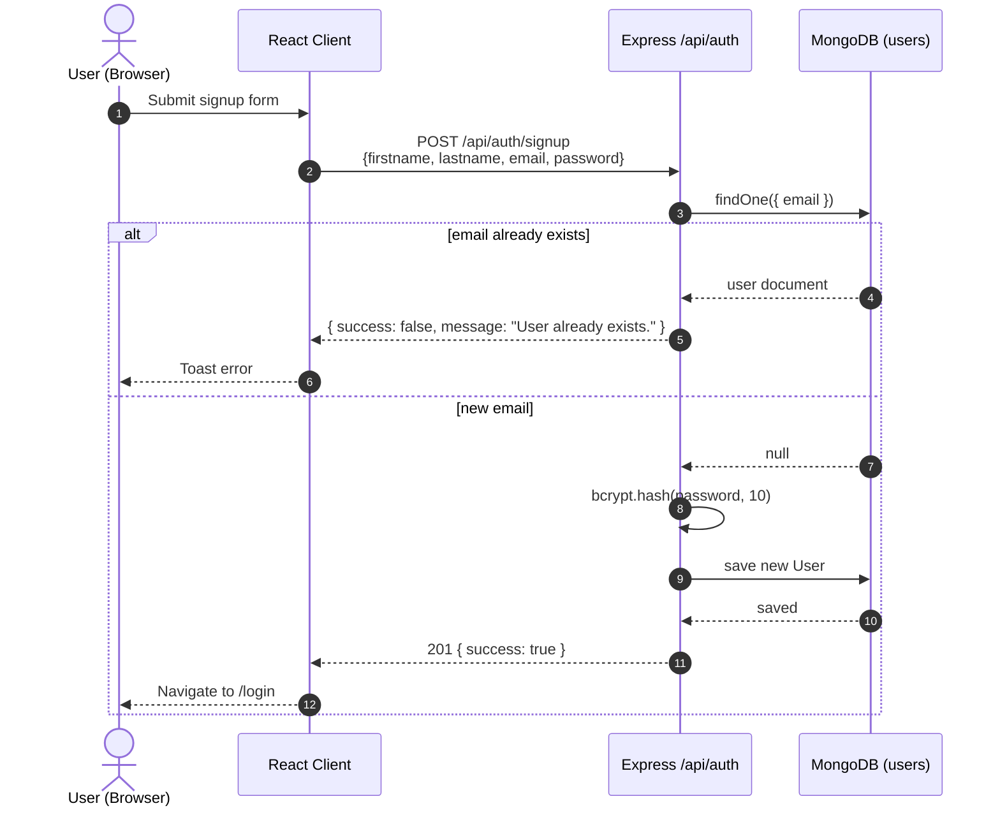
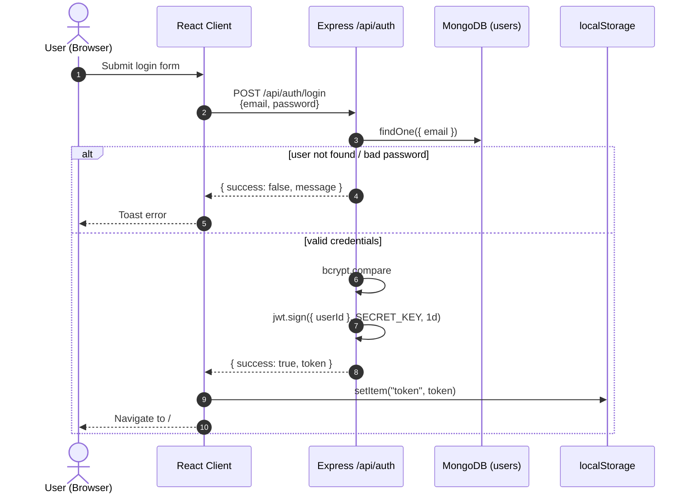
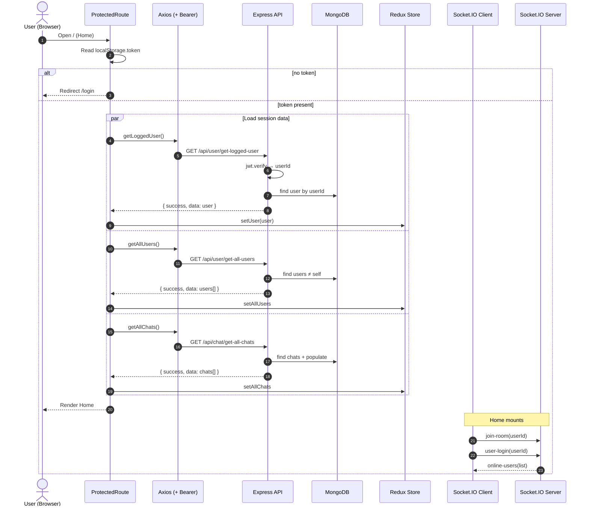
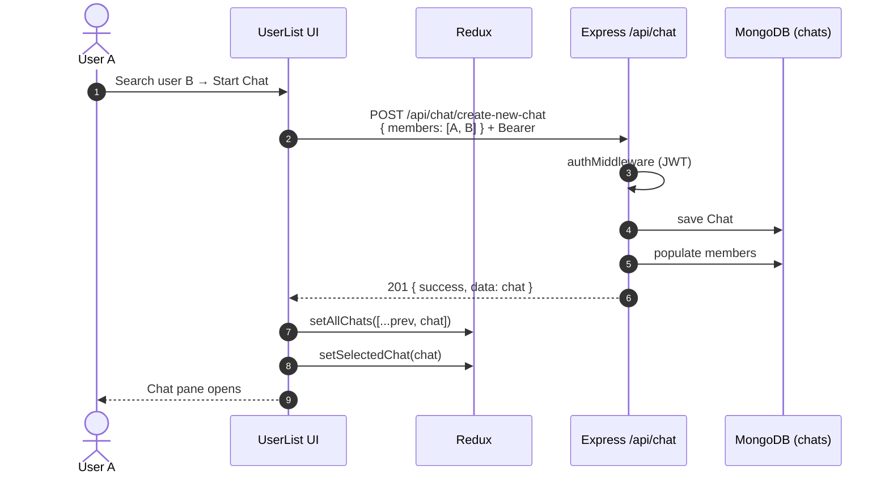
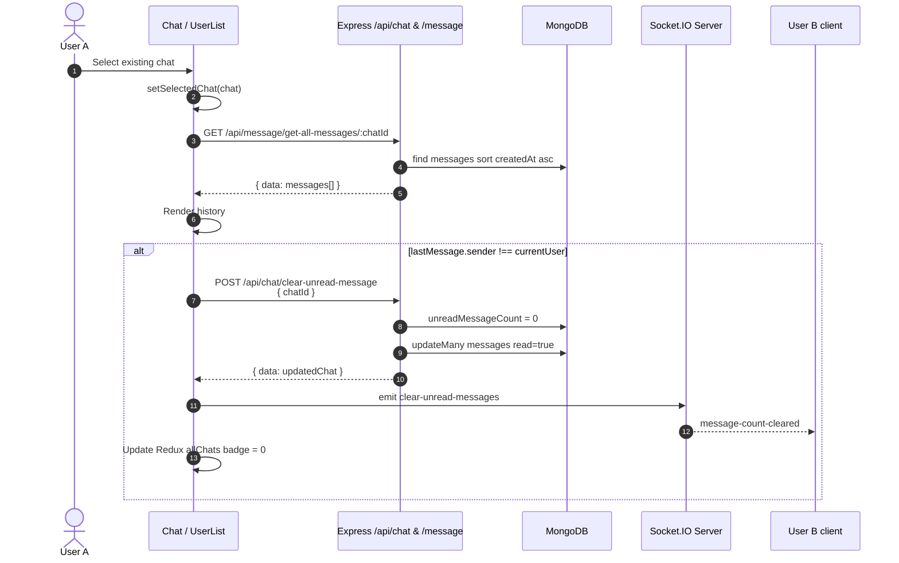
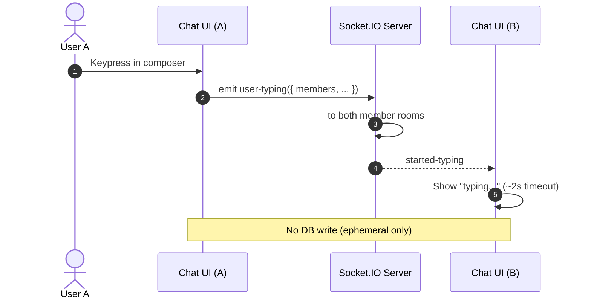
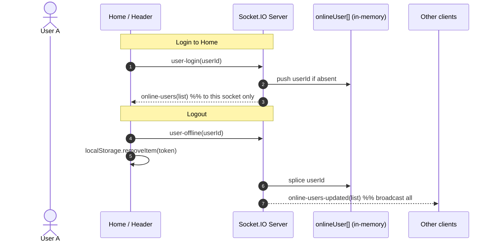
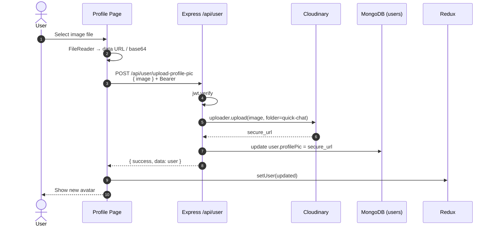

# Quick Chat — Sequence Diagrams Pack

Companion to [HLD](./01-HLD-architecture.md) and [Backend LLD](./02-LLD-backend.md).  
Diagrams use Mermaid (`sequenceDiagram`) and match current code behavior.

---

## SD-01 — User signup



---

## SD-02 — User login + JWT storage



---

## SD-03 — Enter protected app (bootstrap)



---

## SD-04 — Create new 1:1 chat



---

## SD-05 — Send message (REST + Socket)

```mermaid
sequenceDiagram
    autonumber
    actor A as User A
    participant CA as Chat UI (A)
    participant API as Express /api/message
    participant DB as MongoDB
    participant IO as Socket.IO Server
    participant CB as Chat UI (B)

    A->>CA: Type text / attach image → Send
    CA->>CA: Build message object<br/>(chatId, sender, text?, image?, members)

    Note over CA,API: Persistence path
    CA->>API: POST /api/message/new-message + Bearer
    API->>DB: insert Message
    API->>DB: update Chat<br/>lastMessage + $inc unreadMessageCount
    API-->>CA: 201 { success, data: savedMessage }

    Note over CA,IO: Real-time path
    CA->>IO: emit send-message(message)
    IO->>IO: to(members[0]).to(members[1])
    IO-->>CA: receive-message / set-message-count
    IO-->>CB: receive-message / set-message-count

    CA->>CA: Append to allMessages / refresh chats
    CB->>CB: If chat open → append;<br/>else bump unread UI
```

---

## SD-06 — Open chat & clear unread



---

## SD-07 — Typing indicator



---

## SD-08 — Online / offline presence



---

## SD-09 — Upload profile picture



---

## SD-10 — Logout

```mermaid
sequenceDiagram
    autonumber
    actor U as User
    participant HD as Header
    participant LS as localStorage
    participant IO as Socket.IO Server
    participant R as React Router

    U->>HD: Click logout
    HD->>IO: emit user-offline(userId)
    HD->>LS: removeItem("token")
    HD->>R: navigate /login
    Note over HD,R: Redux may retain stale user until refresh;<br/>next ProtectedRoute requires token
```

---

## How to present in interviews

1. Start with **SD-02 + SD-03** (auth session).  
2. Then **SD-05** (hybrid REST + Socket — strongest design point).  
3. Mention **SD-08** limitation: in-memory presence, not multi-instance safe.  
4. Point reviewers to OpenAPI for exact payloads: [05-openapi.yaml](./05-openapi.yaml).
