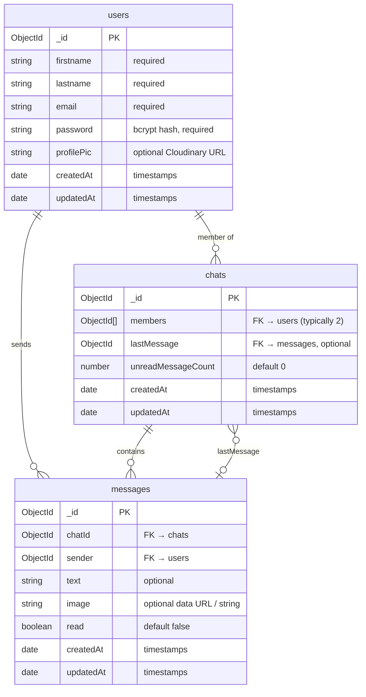

# Quick Chat — Database ER Diagram

Companion to [Backend LLD](./02-LLD-backend.md).  
Models: `server/models/user.js`, `chat.js`, `message.js` (Mongoose → MongoDB collections).

---

## ER diagram (Mermaid)



---

## Relationship summary

| From | To | Cardinality | How it is stored |
|------|-----|-------------|------------------|
| `users` ↔ `chats` | M:N (practical 1:1 chat = 2 users) | `chats.members[]` refs `users` |
| `users` → `messages` | 1:N | `messages.sender` refs `users` |
| `chats` → `messages` | 1:N | `messages.chatId` refs `chats` |
| `chats` → `messages` | 0..1 (pointer) | `chats.lastMessage` refs latest message |

---

## ASCII ER (interview whiteboard)

```text
┌─────────────────────┐
│       users         │
├─────────────────────┤
│ _id            PK   │
│ firstname           │
│ lastname            │
│ email               │
│ password            │
│ profilePic          │
│ createdAt           │
│ updatedAt           │
└──────────┬──────────┘
           │
           │ members[]          sender
           │◄──────────────┐      │
           │               │      │
           ▼               │      ▼
┌─────────────────────┐    │  ┌─────────────────────┐
│       chats         │    │  │      messages       │
├─────────────────────┤    │  ├─────────────────────┤
│ _id            PK   │    │  │ _id            PK   │
│ members[]      FK───┘    │  │ chatId         FK───┼──► chats
│ lastMessage    FK────────┼──│ sender         FK───┘
│ unreadMessageCount  │    │  │ text                │
│ createdAt           │    │  │ image               │
│ updatedAt           │    │  │ read                │
└─────────────────────┘    │  │ createdAt           │
           ▲               │  │ updatedAt           │
           │               │  └─────────────────────┘
           └───────────────┘
             lastMessage (0..1)
```

---

## Collection notes (Mongo-specific)

| Topic | Detail |
|-------|--------|
| DB engine | MongoDB (Atlas); schemas via Mongoose |
| Collection names | `users`, `chats`, `messages` |
| IDs | `ObjectId` |
| Populate | API uses `.populate('members')`, `.populate('lastMessage')` |
| Soft indexes today | No unique index on `email` in schema (enforced only in signup logic) |
| Unread | Denormalized counter on `chats` + per-message `read` flag |

---

## Field dictionary

### users

| Field | Type | Constraints |
|-------|------|-------------|
| firstname | String | required |
| lastname | String | required |
| email | String | required |
| password | String | required (hashed) |
| profilePic | String | optional |

### chats

| Field | Type | Constraints |
|-------|------|-------------|
| members | `[ObjectId]` → users | array of refs |
| lastMessage | ObjectId → messages | optional |
| unreadMessageCount | Number | default `0` |

### messages

| Field | Type | Constraints |
|-------|------|-------------|
| chatId | ObjectId → chats | |
| sender | ObjectId → users | |
| text | String | optional |
| image | String | optional |
| read | Boolean | default `false` |

---

## Suggested indexes (not in code yet — good interview add-on)

```text
users.email                          → unique
chats.members                        → multikey (find chats for a user)
messages.chatId + messages.createdAt → compound (history fetch)
```
